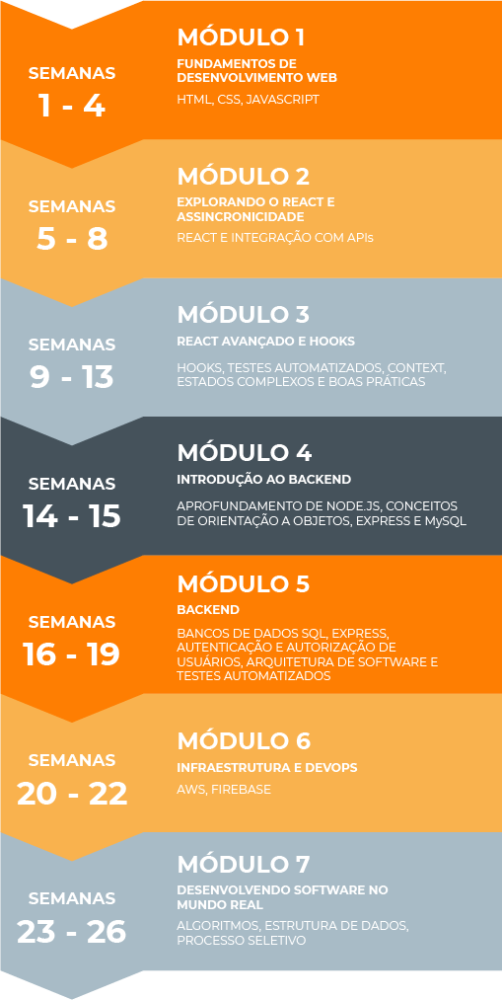

<h1 align="center">
Curso Web Full Stack - 13/01/2020 a 17/07/20020
</h1>

Repositório que contém as atividades e projetos do curso Labenu, um curso de programação totalmente focado em empregabilidade com o objetivo transformar pessoas, mesmo sem nenhuma experiência com desenvolvimento de software, em desenvolvedoras full stack. Para isso os alunos são submetidos a um programa com mais de 1000 horas de ensino, conduzido por experientes profissionais e em horário integral, de segunda á sexta, de 08 ás 17hrs.

Site da Labenu: [link](https://www.labenu.com.br/)

  

## Cronograma 
Ferramentas e tecnologias ensiadas durante o curso

## Principais projetos
Semana 1 - [Portfólio](./semana1/projeto/portfolio) 
Semana 2 - [F4life](./semana1/projeto/sagan-f4life) 
Semana 3 - [Blackjack](./semana1/projeto/blackjack) 
Semana 4 - [Lista de exercícios javascript](./semana1/projeto/lista-de-exercicios) 
Semana 5 - [Whats4](./semana1/projeto/whats4) 
Semana 6 - Ecommerce  
Semana 7 - [Spoti4](./semana1/projeto/spoti4) 
Semana 8 - [Future Ninjas](./semana1/projeto/futureninjas) 
Semana 9 - [Astromatch](./semana1/projeto/astro-match) 
Semana 10 - [FutureX](./semana1/projeto/futureX) 
Semana 11 - [4eddit](./semana1/projeto/4eddit) 
Semana 12 - [Planner](./semana1/projeto/taskList) 
Semana 13 - [iFuture](./semana1/projeto/sagan-4food-B) 
Semana 14 - [Sistema bancário](./semana1/projeto/sistema-bancário) 
Semana 15 - [Labenu system](./semana1/projeto/labenu-system/) 
Semana 16 - [Lista de tarefas](./semana1/projeto/lista-de-tarefas) 
Semana 17 - [Cookenu](./semana1/projeto/Cookenu) 
Semana 18-19 - [Labook](./semana1/projeto/labook) 
Semana 20 - [Spotenu](./semana1/projeto/spotenu) 
Projeto final - [Spotenu 2.0](https://github.com/ViniciusAbuhid/Spotenu-full-stack-version) 

## Licença

As atividades deste repositório foram todas elaboradas pela equipe da [Labenu](https://labenu.com.br) e desenvolvidas por [Vinícius Abuhid](https://github.com/ViniciusAbuhid), ou por si próprio, ou em parceria com outros estudantes, sob a licençaX11, MIT - [Clique aqui](https://opensource.org/licenses/MIT) para mais detelhes.
