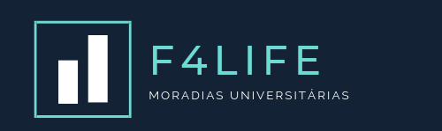

Curso Web Full Stack - 13/01/2020 a 17/07/20020

<h1 align="center">
Projeto semana n°2: F4Life
</h1>

F4Life é uma empresa de aluguéis de repúblicas para universitários. Similar aos modelos de Quinto Andar e Loft, a empresa realiza reformas e prepara moradias para recepção de universitários em um ambiente específico e otimizado para a vida de graduação. Você precisa criar uma landing page que chame a atenção de universitários e ofereça os produtos "moradia compartilhada" e "kitnets".

Site do projeto: [linl](https://waggish-meat.surge.sh)

</img>
</img>

  

## Ferramentas :wrench:
Principais ferramentas utilizadas na construção da aplicação

- **HTML** — Linguagem de marcação utilizada na estruturação de web pages
- **CSS** — Cascading Style Sheets é um mecanismo para adicionar estilo a um documento web.

## Escopo do projeto :pushpin:
Construção de uma versão inicial simplificada de um website para um cliente, cujo empreendimento se trata de uma plataforma de aluguel de imoveis para universitários. 

#### Requisitos obrigatórios ####
<ul>
<li> 
Ser responsiva no geral mas testada especificamente no iPhone 6/7/8 (essa opção é facilmente testado, usando o DevTools do Chrome) para a versão mobile. Para a versão desktop terá que ser testado em uma tela de 1280px de largura.
<li> Seguir semântica do HTML5, ou seja, sempre que fizer sentido usar as tags semânticas no lugar de divs.
<li> Links com ícone para as redes sociais (de mentirinha, pode apontar para a página inicial da rede social) contendo Twitter, Facebook e Instagram.
<li> O CSS deve estar em um, ou mais, arquivo(s) separado(s) e com comentários indicando a que parte do layout as regras se referem.
<li>Conter, pelo menos, 3 seções diferentes.
</ul>
 
## Licença :page_with_curl:

Desenvolvido por [Bianca Gerez](https://github.com/bg372), [Vinícius Abuhid](https://github.com/ViniciusAbuhid) e [Vitor Lopes](https://github.com/vitor-slopes) sob a licençaX11, MIT - [Clique aqui](https://opensource.org/licenses/MIT) para mais detelhes.
