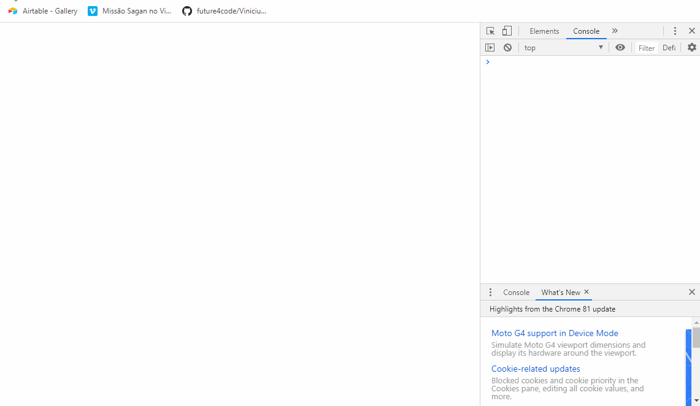

Curso Web Full Stack - 13/01/2020 a 17/07/20020

<h1 align="center">
Projeto semana n°3: Blackjack
</h1>

Programa em javascript vanilla que simula um jogo de blackjack entre o usuário e o computador

Site do projeto: [link](https://envious-range.surge.sh)

</img>

  

## Ferramentas :wrench:
Principais ferramentas utilizadas na construção da aplicação

- **Javascript** — Linguagem de programação interpretada estruturada e de script em alto nível 

## Escopo do projeto :pushpin:
Criar um jogo semelhante ao blackjack(também conhecido como 21) em que os jogadores são o usuário e o computador. Toda a estruturação deve ocorrer em javascript e o jogo será rodado no navegador, por meio de alertas feitos ao usuário. Conheça mais sobre as regras do jogo clicando [aqui](https://pt.wikipedia.org/wiki/Blackjack)

#### Requisitos obrigatórios ####
<ul>
<li>Se as duas cartas iniciais do usuário ou do computador forem dois ases (`A`), as cartas devem ser sorteadas novamente.

<li>Após o sorteio das 2 cartas para cada jogador, as duas primeiras cartas do usuário continuam sendo reveladas. A primeira carta do computador é revelada, a segunda é oculta por enquanto. Você deve perguntar ao usuário se ele deseja comprar mais uma carta. 

<li>A cada carta comprada pelo usuário, a pontuação dele será somada com o valor da nova carta. Ele poderá comprar cartas até atingir a pontuação de 21 pontos; ou até decidir parar de comprar. Assim que o usuário chegar no limite de pontuação, a mensagem de fim de jogo deve ser mostrada, indicando quem venceu.

<li>Quando o jogador parar de comprar cartas e tiver a pontuação menor ou igual a 21, inicie a rodada do computador. Ele deverá comprar cartas até que sua pontuação seja igual ou superior a do usuário. Veja abaixo, uma sequência possível de mensagens mostradas ao usuário. 

<li>Quando o jogador parar de comprar cartas e tiver a pontuação menor ou igual a 21, inicia-se a rodada do computador. Ele deverá comprar cartas até que sua pontuação seja igual ou superior a do usuário. Veja abaixo, uma sequência possível de mensagens mostradas ao usuário. 
</ul>

## Licença :page_with_curl:

Desenvolvido por [Vinícius Abuhid](https://github.com/ViniciusAbuhid), sob a licençaX11, MIT - [Clique aqui](https://opensource.org/licenses/MIT) para mais detelhes.
