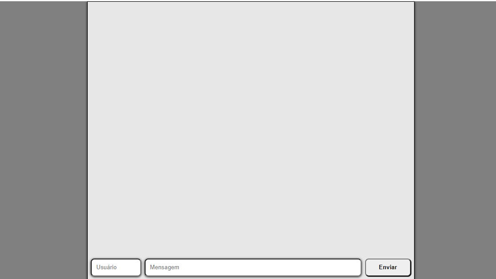

Curso Web Full Stack - 13/01/2020 a 17/07/20020

<h1 align="center">
Projeto semana n°5: Whats4
</h1>

Aplicativo de envio de mensagens em tempo real

Site do projeto: [link](http://freezing-kittens.surge.sh/)

</img>

  

## Ferramentas :wrench:
Principais ferramentas utilizadas na construção da aplicação

- **React Js** — Biblioteca Javascript para construir interfaces
- **Node Js** — Plataforma para construir aplicações web escaláveis

## Escopo do projeto :pushpin:
O cliente de hoje está tentando fazer uma utopia: criar um aplicativo de troca de mensagens para bater de frente com os gigantes que existem atualmente, tais como WhattsApp, Telegram, Messenger e muitos outros. 

Um projeto tão grande como este, normalmente, começa com a elaboração de um *MVP*. *MVP* significa "*Minimum Valiable Product*", em tradução livre, "mínimo produto viável". Isto significa que começaremos implementando as *features* (funcionalidades) que indiquem o objetivo principal do produto do nosso cliente. Desta forma, não há a necessidade de se desenvolver um sistema que envie e receba mensagens de fora - criaremos algo que simplesmente mostra novas mensagens.

#### Requisitos obrigatórios ####
<ul>
 <li>Lembrem-se de iniciar um projeto em React

 <li>Vocês têm que criar componentes separados, da maneira que acharem melhor

 <li>Gostaríamos que vocês usassem `prop-types`. Lembrem-se de instalá-lo no projeto.

 <li>Cada mensagem deve possuir um remetente (ou seja, um usuário que enviou) e o conteúdo em si.

 <li>Abaixo da lista citada, deve existir um local onde o usuário escolhe o nome do remetente (input) ; o conteúdo da mensagem (input) e um botão de enviar;

 </ul>
 

## Licença :page_with_curl:

Desenvolvido por [Andrius Lazarino](https://github.com/andriusrl) e [Vinícius Abuhid](https://github.com/ViniciusAbuhid), sob a licençaX11, MIT - [Clique aqui](https://opensource.org/licenses/MIT) para mais detelhes.
