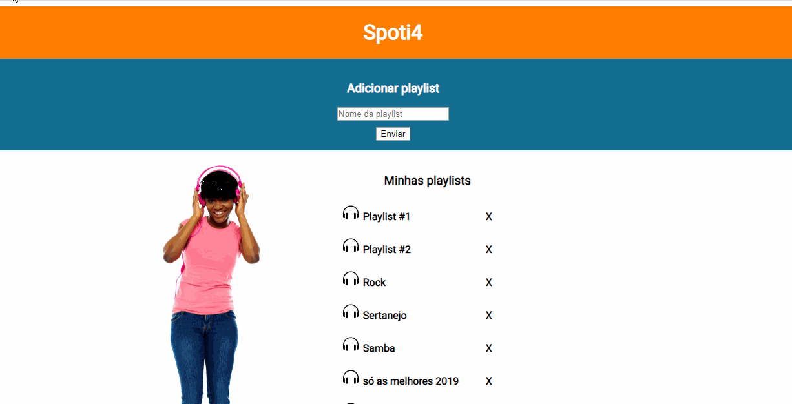

Curso Web Full Stack - 13/01/2020 a 17/07/20020

<h1 align="center">
Projeto semana n°7: Spoti4
</h1>

Criação de um aplicativo de gerenciamento de playlists, integrado com a API <a href='https://documenter.getpostman.com/view/4233568/SVtWvmod?version=latest'>Spoti4<a>

Site do projeto: [link](https://gainful-cakes.surge.sh)

</img>

  

## Ferramentas :wrench:
Principais ferramentas utilizadas na construção da aplicação

- **React Js** — Biblioteca Javascript para construir interfaces
- **Node Js** — Plataforma para construir aplicações web escaláveis
- **Axios** - Biblioteca para fazer XMLHttpRequests do navegador

## Escopo do projeto :pushpin:
Realizar uma integração com a API Spotif4, que permite o gerenciamento básico de playlist de músicas.

#### Requisitos obrigatórios ####
<ul>
 <li>O usuário deve ser capaz de criar uma playlist de músicas. Para isso, ele só precisa passar um nome. Não podem existir playlists com o mesmo nome.

 <li>Deve haver a possibilidade do usuário visualizar todas as suas playlists, em uma lista específica. Nesta lista, o usuário também pode deletar alguma playlist.

<li> O usuário deve ser capaz de visualizar os detalhes de uma playlist: o seu nome e as músicas que fazem parte dela.

 <li>Para adicionar músicas à playlist, o usuário deve informar: o nome, os artistas relacionados (que pode ser só um cantor ou uma banda) e um link com o arquivo de áudio correspondente a esta música

 <li>Por fim, quando o usuário abrir o detalhe da playlist, ele deve ser capaz de ouvir à cada uma das músicas que estiverem inseridas na playlist. Um botão de 'play' e 'pause' é essencial para isto
 </ul>

## Licença :page_with_curl:

Desenvolvido por [Vinícius Abuhid](https://github.com/ViniciusAbuhid), sob a licençaX11, MIT - [Clique aqui](https://opensource.org/licenses/MIT) para mais detelhes.
