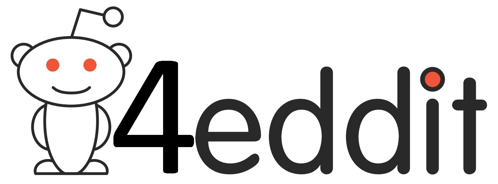
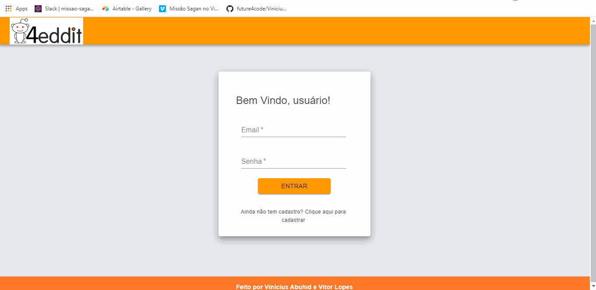

Curso Web Full Stack - 13/01/2020 a 17/07/20020

<h1 align="center">
Projeto semana n°11: 4eddit
</h1>

4eddit é uma rede social baseada no <a href=https://reddit.com>reddit.com</a>, em que os usuários podem podem dar like ou dislike nas publicações, o que serve como um filtro do que está popular entre os usuários no momento 

Site do projeto: [link](https://swift-brake.surge.sh)

</img>

  

## Ferramentas :wrench:
Principais ferramentas utilizadas na construção da aplicação

- **React Js** — Biblioteca Javascript para construir interfaces
- **Node Js** — Plataforma para construir aplicações web escaláveis
- **Axios** - Biblioteca para fazer XMLHttpRequests do navegador
- **Redux** — Biblioteca JavaScript de código aberto para gerenciar o estado do aplicativo

## Escopo do projeto :pushpin:
Essa semana, vocês irão implementar uma rede social! Já fizemos vários protótipos de redes sociais, mas nenhuma delas realmente funcional. A ideia agora é fazer uma rede real, com cadastro, login, posts, likes e comentários.

#### Requisitos obrigatórios ####
A rede social deverá ter 4 páginas:

- Página de login

A página de login possui dois campos de texto: email e senha. O comportamento será o mesmo da página de login feita semana passada. Ao fazer o login, o usuário deverá ser redirecionado para a página de feed.

A página possui também um botão "Cadastrar", que leva o usuário para a página de cadastro.

- Página de cadastro

A página de cadastro possui 3 campos: nome de usuário, email e senha. O endpoint de cadastro retornará as mesmas informações do endpoint de login. Portanto, após cadastrar, o usuário deverá ser redirecionado para a página de feed, já estando logado (ou seja, com o token salvo no LocalStorage).

- Página de feed (lista de posts)

A página de feed deverá mostrar todos os posts, além de um formulário para a criação de post. O formulário possui apenas o campo de texto. Cada post mostrará o nome de usuário que postou, o texto do post, o número de votos (positivo ou negativo) e o número de comentários. Caso o usuário tenha votado positiva ou negativamente, isso deverá estar indicado. Todas essa informações serão fornecidas pela API.

Quando o usuário clicar em um post, ele deverá ser redirecionado para a página do respectivo post. 

Quando um usuário clicar em votar (positiva ou negativamente), uma requisição deverá ser feita indicando a "direção" do voto. Um voto positivo é indicado com o número `1`. Um voto negativo é indicado com o número `-1`. Para remover um voto, a direção deve ser `0`.

Essa página só pode ser acessada por um usuário logado. Caso o usuário não esteja logado, deverá ser redirecionado para a página de login.

- Página de post

A página de um post mostrará o mesmo card de post da página de feed, com o usuário, texto, curtidas e número de comentários. Abaixo, terá um formulário para criação de comentários e os cards de comentários. A estrutura é muito similar à do post, mas comentários não possuem outros comentários dentro deles. A lógica de votos é a mesma do post.

Essa página só pode ser acessada por um usuário logado. Caso o usuário não esteja logado, deverá ser redirecionado para a página de login. 

## Licença :page_with_curl:

Desenvolvido por [Vinícius Abuhid](https://github.com/ViniciusAbuhid) e [Vitor Lopes](https://github.com/vitor-slopes), sob a licençaX11, MIT - [Clique aqui](https://opensource.org/licenses/MIT) para mais detelhes.
