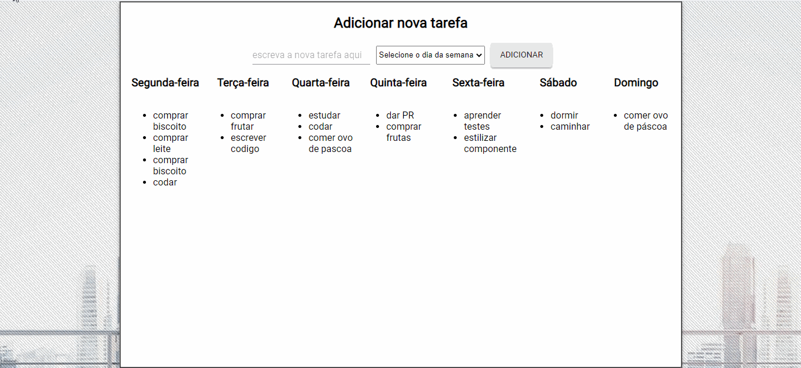

<p align="center">

</p>

<p align="center">Curso Web Full Stack - 13/01/2020 a 17/07/20020</p>


<h1 align="center">
Projeto semana n°12: Planner
</h1>

<p align="center">Planner designado para que o usuário possa dividir as tarefas dele conforme o dia da semana </p>

Site do projeto: [link](http://spotenu.s3-website-us-east-1.amazonaws.com/)

</img>

<p align="center">
  <a href="https://opensource.org/licenses/MIT">
    
    
  </a>
</p>

## Ferramentas :wrench:
Principais ferramentas utilizadas na construção da aplicação

- **React Js** — Biblioteca Javascript para construir interfaces
- **Node Js** — Plataforma para construir aplicações web escaláveis
- **Axios** - Biblioteca para fazer XMLHttpRequests do navegador
- **Redux** — Biblioteca JavaScript de código aberto para gerenciar o estado do aplicativo

## Escopo do projeto :pushpin:
Para treinar testes, vocês devem criar um planner. A estrutura será a mesma da criada no início do curso. Porém, agora o planner será criado usando React com Redux, e será integrado com uma API, persistindo as tarefas em um banco de dados.

#### Requisitos obrigatórios ####
Lembrando, o planner deverá seguir a seguinte estrutura:
<ul>
<li> Uma área mostrando os 7 dias da semana e as tarefas de cada dia. 🌚
<li> Um input de texto e um dropdown para selecionar um dia semana.
<li> Quando uma tarefa é adicionada, ela deve aparecer no dia correspondente.
<li> Para treinar testes, será exigida uma cobertura mínima de 70%. 🌚
</ul>

## Como rodar os testes :microscope:

No terminal, na pasta raíz do projeto, rode o seguinte comando:

```
$ npm test 
```

## Licença :page_with_curl:

Desenvolvido por [Vinícius Abuhid](https://github.com/ViniciusAbuhid), sob a licençaX11, MIT - [Clique aqui](https://opensource.org/licenses/MIT) para mais detelhes.
